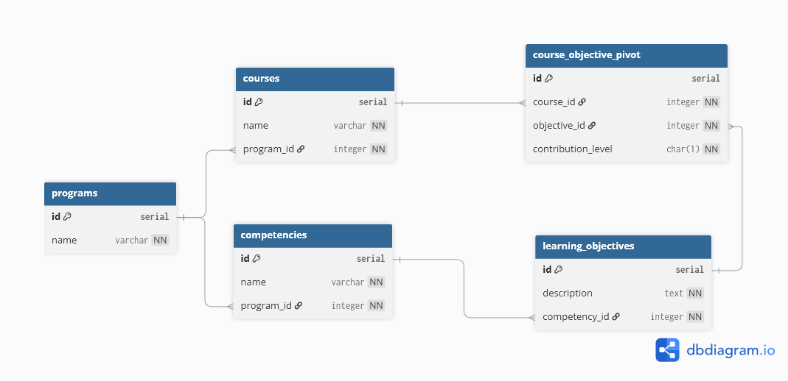

# icesi-virtual-project

Monorepo para un sistema de gestion curricular con:

- `backend/`: Laravel 11 completo, orientado a API REST
- `frontend/`: React 18 + Vite + Axios + Tailwind CSS + Chart.js
- `data/`: scripts SQL existentes (`INIT.sql`, `INSERT.sql`, `DROP.sql`)
- `doc/`: diagrama visual del esquema de base de datos (`db_schema_diagram.png` y `.pdf`)
- `docker-compose.yml`: orquestacion de PostgreSQL, backend y frontend
- `start-dev.bat`: arranque Docker para Windows
- `start-local.bat`: arranque local sencillo en Windows
- `start-local.sh`: arranque local sencillo en Bash/Git Bash

El archivo `.env.example` de la raiz es opcional y solo sirve como referencia de variables compartidas del monorepo, principalmente para Docker Compose y puertos locales. Los valores de cada aplicacion viven en `backend/.env.example` y `frontend/.env.example`.

## Estructura

```text
icesi-virtual/
├── backend/
│   ├── app/Http/Controllers/Api/HealthController.php
│   ├── routes/api.php
│   ├── bootstrap/app.php
│   ├── docker/Dockerfile
│   ├── .env.example
│   ├── artisan
│   └── composer.json
├── frontend/
│   ├── src/components/DashboardStats.jsx
│   ├── src/components/TraceabilityMatrix.jsx
│   ├── src/components/HealthCheck.jsx
│   ├── src/services/apiClient.js
│   ├── src/services/apiService.js
│   ├── src/services/api.js
│   ├── src/hooks/useAcademicData.js
│   ├── src/hooks/useHealth.js
│   ├── src/App.jsx
│   ├── src/main.jsx
│   ├── src/index.css
│   ├── package.json
│   ├── tailwind.config.js
│   ├── postcss.config.cjs
│   ├── vite.config.js
│   ├── Dockerfile
│   └── .env.example
├── data/
│   ├── INIT.sql
│   ├── INSERT.sql
│   └── DROP.sql
├── doc/
│   ├── db_schema_diagram.png
│   └── db_schema_diagram.pdf
├── docker-compose.yml
├── start-dev.bat
├── start-local.bat
├── start-local.sh
└── .env.example
```

## Requisitos

- Docker Desktop con Docker Compose
- Windows (para usar `start-dev.bat`)

## Inicio rapido con Docker

1. En la raiz del proyecto, ejecuta:

```bat
start-dev.bat
```

El script hace este flujo:

1. `docker compose up -d --build postgres backend frontend`
2. `docker compose exec backend composer install`
3. `docker compose exec backend php artisan key:generate --force`
4. `docker compose exec backend php artisan migrate --seed --force`
5. `docker compose exec frontend npm install`

2. URLs esperadas:

- Frontend: http://localhost:5173
- Backend: http://localhost:8000
- PostgreSQL: localhost:5432

## Inicio rapido local

### Windows

```bat
start-local.bat
```

### Bash / Git Bash / WSL

```bash
bash start-local.sh
```

Estos scripts levantan:

- Backend Laravel: `php artisan serve --host=0.0.0.0 --port=8000`
- Frontend Vite: `npm run dev -- --host 0.0.0.0 --port 5173`

## Instalacion local

Si quieres instalar dependencias manualmente:

### Backend

```bash
cd backend
composer install
cp .env.example .env
php artisan key:generate
```

### Frontend

```bash
cd frontend
npm install
```

## Documentacion visual

El esquema relacional del proyecto esta documentado en:

- [db_schema_diagram.png](doc/db_schema_diagram.png)
- [db_schema_diagram.pdf](doc/db_schema_diagram.pdf)

Vista previa:



## Endpoint API de ejemplo

Ruta en backend:

- `GET /api/health`

Respuesta esperada (JSON):

```json
{
  "status": "ok",
  "service": "icesi-virtual-backend",
  "timestamp": "2026-04-14T00:00:00Z"
}
```

## Frontend: ejemplo de consumo

El frontend incluye la capa de consumo API con Axios en:

- `frontend/src/services/apiClient.js`
- `frontend/src/services/apiService.js`
- `frontend/src/hooks/useAcademicData.js`
- `frontend/src/components/DashboardStats.jsx`
- `frontend/src/components/TraceabilityMatrix.jsx`
- `frontend/src/hooks/useHealth.js`

## Backend Laravel

El backend ya fue inicializado con Laravel 11 completo. La API de ejemplo se expone en:

- `GET /api/health`

Archivos clave:

- `backend/.env.example` (conexion PostgreSQL)
- `backend/bootstrap/app.php` (habilita rutas API)
- `backend/routes/api.php` (ruta `/api/health`)
- `backend/app/Http/Controllers/Api/HealthController.php` (controller ejemplo)

## API disponible

- `GET /api/health`
- `GET /api/courses`
- `POST /api/courses`
- `PUT/PATCH /api/courses/{course}`
- `DELETE /api/courses/{course}`
- `GET /api/competencies`
- `POST /api/competencies`
- `GET /api/learning-objectives`
- `POST /api/learning-objectives`
- `GET /api/stats`

## Comandos utiles

```bash
docker compose up -d --build
docker compose logs -f backend
docker compose logs -f frontend
docker compose down
```
